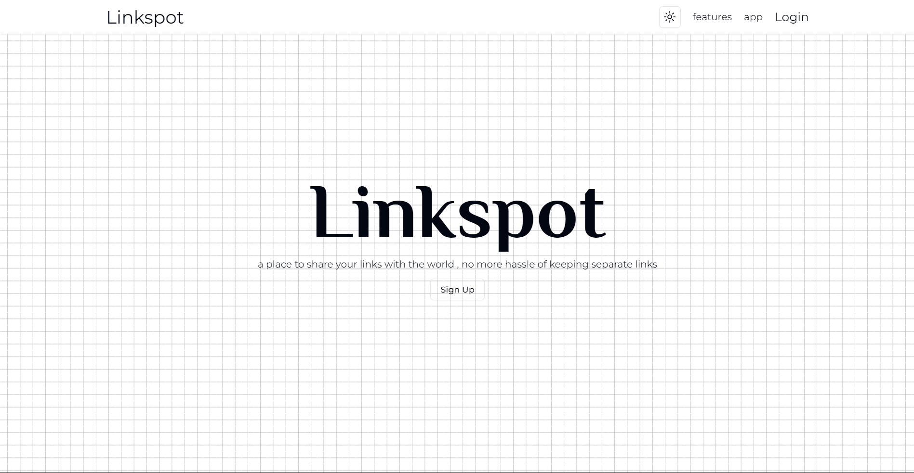

# Linkspot

a place to share your links with the world , no more hassle of keeping separate links

**Tech Stack**

- [Prisma](https://www.prisma.io/) - database ORM
- [MySql](https://planetscale.com/) - planetscale
- [Clerk](https://clerk.com/) - authentication
- [NextJS](https://nextjs.org/) - UI

```bash
git clone https://github.com/itsarunkumar/link-spot.git
```

```bash
npm  run  dev
# or
yarn  dev
# or
pnpm  dev
```

Open [http://localhost:3000](http://localhost:3000) with your browser to see the result.
